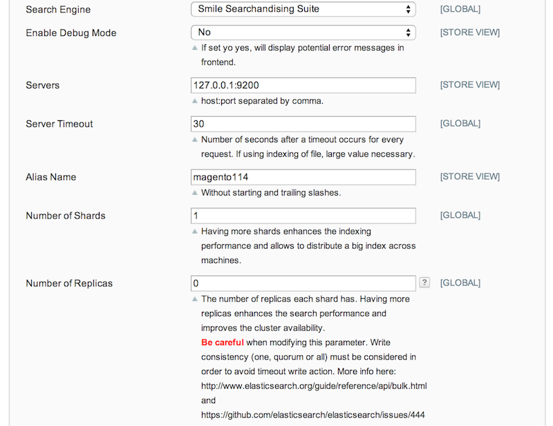

# User documentation

## Global configuration
The global configuration of the module can be found into the **Catalog Search** section of **System > Configuration > Catalog**.

First, you have access to the global configuration of the search engine shared with all other engines (MySQL and SolR) :

Then you have access to the ES search engine parameters. 
You can check here if the search engine is correctly set up (**Search Engine** param should be set to **Smile Serchandizing Suite**). 
Other parameters should be changed only by developers and are documented into the [Installing the module](install.md).

In the end, you have access to ElasticSearch specific configuration parameters :

|Param Name|Description|
-----------|------------
|Facets Max Size|Maximum number of values to display into a facets   **Note :** *This param applies only on term facet and is not used for prices, rating and categories facets.*|
|Enable Search on Options Labels|By default Magento searches only on option ids for select attributes.   This setting allows to use their textual value into fulltext.   Since there is no uses case where the default behavior is expected this setting will be removed from a future version and it's value will be yes by default.|
|Enable ICU Folding Token Filter|ES plugin filter used to clean UTF-8 invalid characters. This feature comes at the expense of the performances and should be enabled only if your catalog contains bad UTF-8 characters.|
|Enable Fuzzy Search|Enable the approching search. Used to automatically fix user mistyping. This feature replaces the traditionnal "Did you mean" feature into the module|
|Fuzzy Prefix Length, Fuzzy Min Similarity, Fuzzy Prefix Length, Fuzzy Max Expansions|Fuzzy search fine tunning.   This parameters can be used to fix the fuzzy search behavior if it match too many or not enough products. Full documentation for the params can be found into ElasticSearch official documentation : http://www.elasticsearch.org/guide/en/elasticsearch/reference/current/query-dsl-flt-query.html|
|Fuzzy Query Boost|Relative weight of fuzzy search result.   Exact matches have a weight of 1.   The default value (0.3) will result approching result being 3 times less important than exact ones.|

> **What is fuzzy search ?**
> 
> Approximate string matching (a.k.a. fuzzy search) is the technique of finding strings that match a pattern approximately (rather than exactly). The problem of approximate string matching is typically divided into two sub-problems: finding approximate substring matches inside a given string and finding dictionary strings that match the pattern approximately.
>
> Into our engine it is used to fix :

> * User mystipings (ex: frankenshten instead of frankenstein)
> * Give reponse for other form of a same word (ex: playing instead of play)
>
> It avoid the usage of a "Did you mean" feature by fixing the user query and consequently avoid an user click to refine it's query.
>
> You can find a very complete documentation about possible implementation of fuzzy search into ES at this address : https://www.found.no/foundation/fuzzy-search/.
>
> The implementation is subject to change into the future. Currently we are using two queries (one for exact match and one for fuzzy) and we combine their scores. An alternative will be evaluated as described into #7.
``

## Attributes configuration

## Virtual categories

## Front Office

### Facets

### Autocomplete

